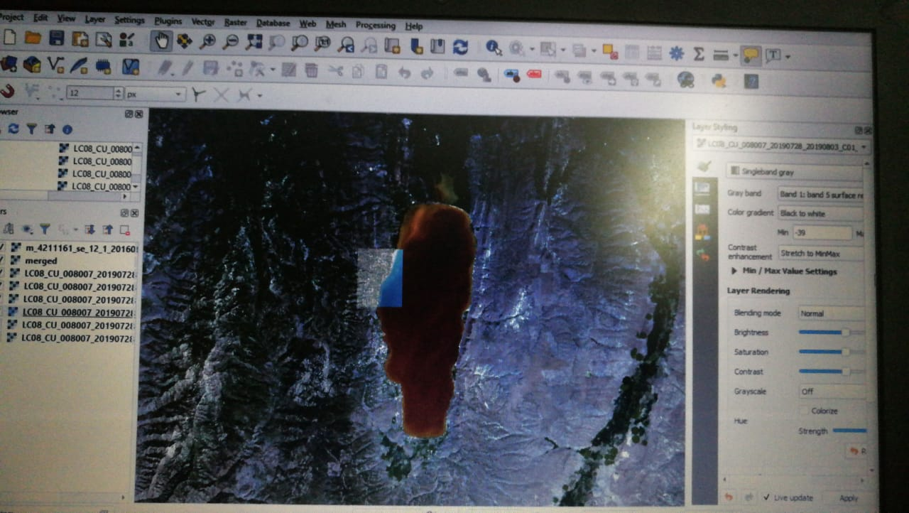
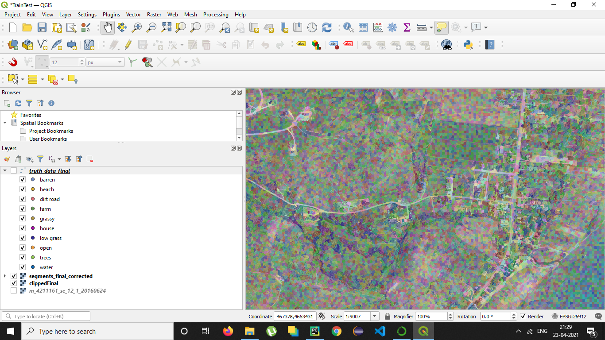
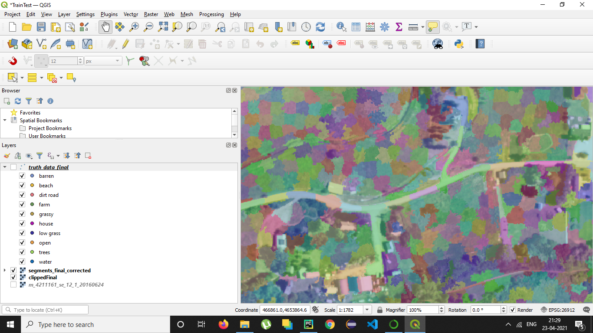
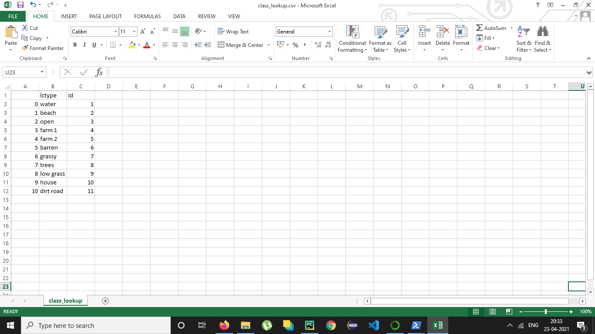
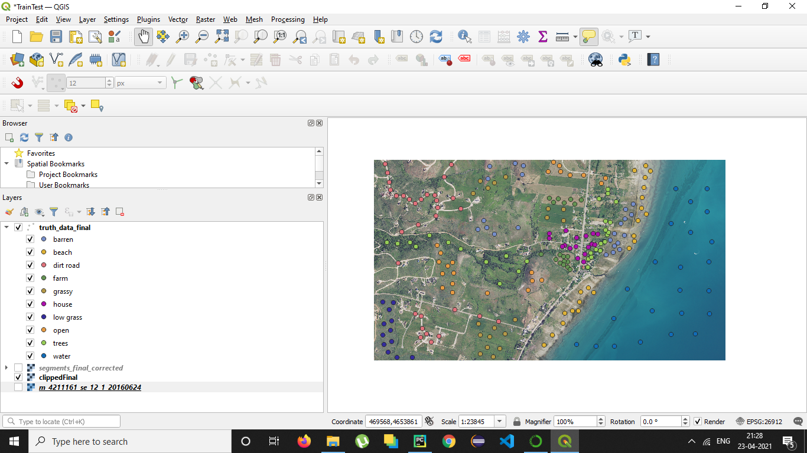
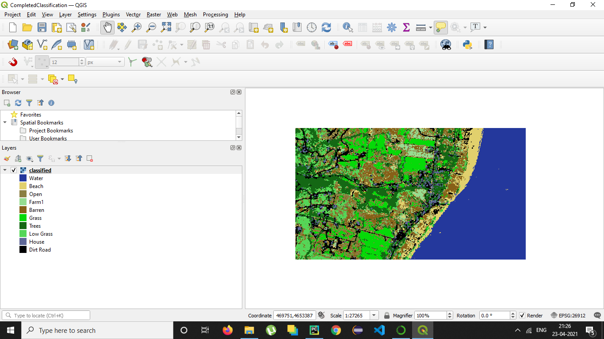
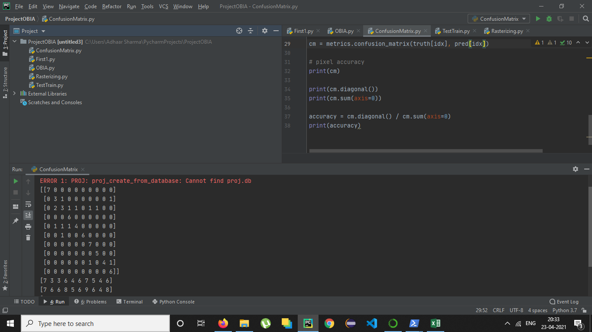
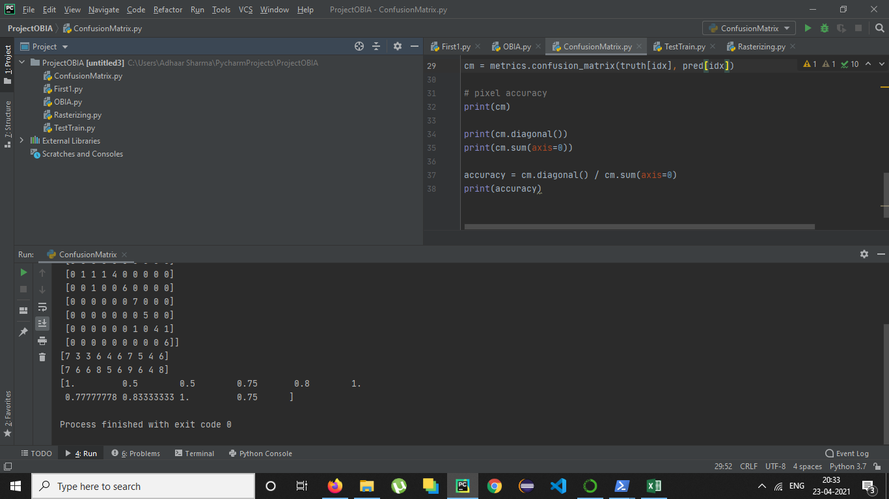

# Satellite-data-classification-using-Random-Forest-Classifier
## Rasterizing Satellite Data

## SLIC Segmentation

## SLIC Segmentation Enhanced
We can observe that boundary of the segments overlaps the contour features

## Classification Features

## Manually Plotted Labelled Features

## Final Classified Satellite Image

## Confusion Matrix

## Accuracy

